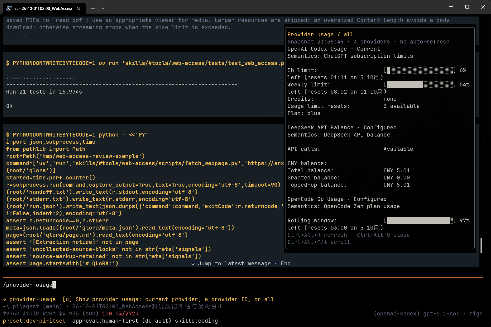

# @frostime/pi-provider-usage

[中文文档](./README.zh-CN.md)

A Pi extension that only queries Provider usage, forked and modified from [pi-usage](https://github.com/narumiruna/pi-extensions/tree/main/packages/pi-usage).

## Usage

```text
/provider-usage                 Query the Provider of the current model
/provider-usage codex           Query OpenAI Codex
/provider-usage opencode-go     Query OpenCode Go
/provider-usage all             Query all configured and supported Providers
```

Type `/provider-usage ` to trigger argument completion. Completion only lists configured, built-in supported Providers and `all`; `codex` is a shorthand for `openai-codex`, and the full ID also works. Querying another Provider does not switch the current model.

The command displays an overlay panel on the right side, showing query progress and snapshot time.



| Shortcut | Action |
| --- | --- |
| `Ctrl+Alt+R` | Re-query the current scope; `all` re-checks configured Providers |
| `Ctrl+Alt+Q` | Close the overlay and cancel any pending queries |
| `Ctrl+Alt+↑/↓` | Scroll through long results |

Running the command again replaces the existing overlay rather than stacking windows. The overlay and input listeners are cleaned up on close, model or session switch, or exit.

## Install from npm

```bash
pi install npm:@frostime/pi-provider-usage
```

## Install from GitHub

```bash
pi install git:github.com/frostime/pi-provider-usage
```

## Local Loading

Requires a Pi version that supports non-focus-stealing overlays, terminal input listeners, and valid authentication endpoint validation; Pi **1.0.2** is used for development and testing.

```bash
# Run in this repository directory, loaded only for this launch
pi -e .

# Or register as a personal local extension
pi install .
```

TypeScript source is loaded directly, no build step required. No third-party runtime dependencies; Pi provides the host packages.

Development checks:

```bash
npm ci --ignore-scripts
npm run check
```

## Scope and Limitations

Retains the upstream 17 Provider IDs; see [Provider documentation](docs/providers.md) for the full list. Different Providers return subscription quotas, balances, or spending respectively; different currencies and billing semantics are not mixed.

- Native `openai` ChatGPT OAuth can only display authentication status and a usage web link; it cannot query numeric quotas. `openai-codex` can query numeric quotas. OpenAI API-key usage queries are not supported.
- Fireworks is queried automatically when only one billing account is visible; when multiple accounts exist, it prompts that an account must be specified. The current version has no account selection feature—it does not default to the first account, nor does it aggregate.
- A Provider query uses the authentication currently resolved by Pi; it does not iterate over other saved accounts.
- Credentials for custom or proxy endpoints are not forwarded to official usage APIs. Official APIs may change, and returned data may be delayed.

For query, timeout, and cancellation behavior, see [Operations documentation](docs/operations.md).

## Security and Provenance

The extension runs with the same process permissions as Pi; only load code you trust. Authentication is used solely to request the matching official APIs; endpoint validation, request-boundary authentication re-verification, error redaction, and response size limits are retained, and HTTP redirects are rejected. Results do not store keys or tokens.

For the upstream snapshot and scope of modifications, see [UPSTREAM.md](UPSTREAM.md). Licensed under [MIT](LICENSE), with upstream copyright notices retained.
